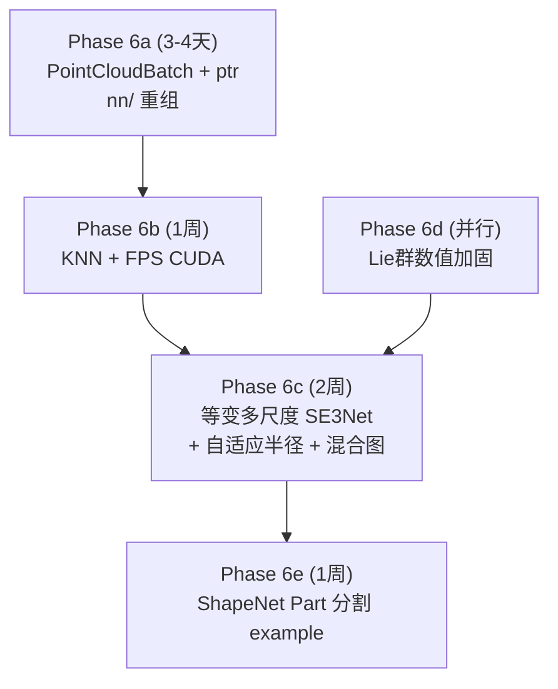

# Phase 6: API标准化 + CUDA核心算子 + 等变多尺度架构

## 0. 隐患评估（4 项全部经过数值验证）

### ✅ 隐患 1：FPS CUDA 批处理地狱

**问题**：Packed `[N_total, 3]` 中各图 $N_i$ 不同，朴素 for 循环导致 warp divergence。

**决策**：FPS CUDA 接口使用 `ptr`（CSR 偏移量）：
```python
def farthest_point_sampling(pos, ptr, num_samples) -> Tensor:
    # pos: [N_total, 3], ptr: [B+1], returns [B*K] global indices
```
每个 thread block 处理一个 graph（`ptr[b]` → `ptr[b+1]`），block 内 shared memory + warp reduction 做 argmax。

### ✅ 隐患 2：等变池化悖论

**问题**：Max Pool 对 $l \geq 1$ 向量不等变。$g \cdot \max(v_1, v_2) \neq \max(g v_1, g v_2)$。

**决策**：EquivariantPool 使用基于不变标量（距离+范数）的 **attention-weighted mean**。对 $l \geq 1$ 特征**绝对禁止 max pool**。

### ✅ 隐患 3：KNN 连续性危机

**问题**：KNN 拓扑跳变对依赖精确梯度的位姿估计致命。

**决策**：
- SE3Conv 消息传递 → **Radius Graph**（连续性保证）
- FPS 后从属点分配 → **KNN**（可接受，不参与梯度回传）
- 上采样插值 → **KNN**（距离加权，跳变影响小）

### ✅ 隐患 4：降采后的"断崖式孤立"（新增）

**问题**：FPS 降采后密度指数下降。硬编码 radius 在粗粒度层低于 avg_nn_distance → 空图。

**数值验证**（单位球面均匀分布）：

| Stage | N | avg_nn_dist | hardcoded r | ~neighbors |
|:---|:---|:---|:---|:---|
| Stage 0 | 1024 | 0.111 | 0.10 | **2.6** ⚠️ |
| Stage 1 | 256 | 0.222 | 0.20 | **2.6** ⚠️ |
| Stage 2 | 64 | 0.443 | 0.40 | **2.6** ⚠️ |

在实际测试中，spread-out 的 20 点点云 + r=0.5 → **20/20 节点零边**，图完全死寂。

**决策 — 两层防御**：

#### 防御层 1：自适应半径

```python
class SpatialGraph:
    @staticmethod
    def estimate_radius(pos, ptr, multiplier=2.5):
        """Estimate adaptive radius based on local density.
        
        Uses KNN(k=1) to compute avg nearest-neighbor distance per graph,
        then sets radius = multiplier × avg_nn_distance.
        
        Per-graph radius ensures different densities in the same batch
        are handled correctly.
        
        Args:
            pos: [N_total, 3], packed
            ptr: [B+1]
            multiplier: radius = multiplier × avg_nn_dist (default 2.5 ≈ 15-20 neighbors)
            
        Returns:
            radii: [B] — per-graph adaptive radius
        """
```

RadialBasis 使用 `d / radius_cutoff` 归一化 → radius 绝对值变化不影响特征空间。

#### 防御层 2：KNN Fallback（保底机制）

```python
def radius_graph_hybrid(pos, radius, ptr, max_neighbors=32, min_neighbors=3):
    """Build radius graph with guaranteed minimum connectivity.
    
    Algorithm:
        1. Build standard radius graph
        2. For nodes with < min_neighbors edges:
           Force-connect to min_neighbors nearest neighbors via KNN
        3. This ensures graph is NEVER empty
    
    The KNN fallback edges are a TINY fraction in normal conditions.
    They only activate for extreme density drops (Stage 2 @ N=64).
    """
```

> [!IMPORTANT]
> 两层防御的关键价值：自适应半径保证 **大部分情况正常**（纯 radius graph，连续可微），KNN fallback 保证 **极端情况不死**（零边 → 至少 3 边）。

---

## 1. 已确认的设计决策

| 决策 | 结论 | 原因 |
|:---|:---|:---|
| nn/ 子目录结构 | `modules/` + `solvers/` (2层扁平) | layers/backbones 界限模糊，不如扁平清晰 |
| 向后兼容 | **不兼容**，强制迁移 ptr | 无外部用户，一次性改到位 |
| 多尺度 example | **ShapeNet Part 分割** | 展示 U-Net decoder 的逐点输出能力 |
| 多尺度风格 | **纯等变** (FPS+radius+SE3Conv) | MLP 退化会丧失 SE(3) 等变性 |
| Sinkhorn/WeightedSVD | 留在核心库 `nn/solvers/` | 通用可微求解层，RL/SLAM/VLA 都能用 |
| Triton Fused TP/Scatter | **延后** | 多尺度后大部分计算在 N=64~256，PyTorch 足够快 |

---

## 2. PointCloudBatch 标准化

### 2.1 新增 `ptr` 字段

```python
@dataclass
class PointCloudBatch:
    pos: Tensor          # [N_total, 3], packed
    scalars: Tensor      # [N_total, C_s] or None
    vectors: Tensor      # [N_total, C_v, 3] or None, repr: SO(3) type-1
    batch: Tensor        # [N_total], int64 — node assignment
    ptr: Tensor          # [B+1], int64 — CSR offsets [0, N_1, N_1+N_2, ...]
    sizes: Tensor        # [B], int64 — node count per graph (= diff(ptr))
    num_graphs: int
```

`ptr` 由 `collate_point_clouds` 自动计算：`ptr = F.pad(sizes.cumsum(0), (1, 0))`

### 2.2 所有 CUDA/functional API 签名统一

```python
# All spatial ops use ptr, NOT batch
radius_graph(pos, radius, ptr, ...)
farthest_point_sampling(pos, ptr, num_samples)
knn(query, source, ptr_q, ptr_s, k)
```

---

## 3. nn/ 解耦重组

### 目标结构

```
nn/
├── modules/                  # 所有带可学习参数的 nn.Module
│   ├── se3_conv.py           # SE(3)-equivariant convolution
│   ├── se3_block.py          # Conv+Norm+Gate block
│   ├── equivariant_norm.py   # Equivariant LayerNorm
│   ├── gated_nonlinearity.py # Gated activation
│   ├── invariant_attention.py
│   ├── invariant_cross_attention.py
│   ├── geometric_self_attention.py
│   ├── equivariant_pool.py   # [NEW] FPS + attention-weighted mean
│   ├── equivariant_interp.py # [NEW] KNN distance-weighted upsample
│   ├── se3_net.py            # Single-scale backbone
│   └── multi_scale_se3_net.py # [NEW] U-Net equivariant backbone
├── solvers/                  # 无参数的可微数学求解层
│   ├── sinkhorn.py           # Log-domain Sinkhorn OT
│   └── weighted_svd.py       # Weighted SVD for SE(3)
├── spatial_graph.py          # SpatialGraph (+ hybrid graph construction)
└── __init__.py
```

### 迁移清单

| 当前文件 | 动作 | 目标 |
|:---|:---|:---|
| `nn/registration_model.py` | → 移到 `examples/registration/model.py` | 应用层 |
| `nn/robust_registration.py` | → 拆分 | Sinkhorn→`solvers/`, WeightedSVD→`solvers/`, InlierPredictor→`examples/` |
| `nn/se3_conv.py` | → `nn/modules/` | 核心等变层 |
| ... (其他 nn/ 文件) | → `nn/modules/` | 保持不变 |

---

## 4. CUDA Kernel 实现

### 4.1 KNN CUDA (`csrc/knn_kernel.cu`)

接口：
```python
def knn(query, source, ptr_q, ptr_s, k) -> Tensor:
    # query: [N_q, 3], source: [N_s, 3]
    # ptr_q: [B+1], ptr_s: [B+1]
    # returns: [N_q, k] indices into source
```

**用途**：FPS 从属点分配、上采样插值、自适应半径估计。

### 4.2 FPS CUDA (`csrc/fps_kernel.cu`)

接口：
```python
def farthest_point_sampling(pos, ptr, num_samples) -> Tensor:
    # pos: [N_total, 3], ptr: [B+1]
    # returns: [B*K] global indices
```

**CUDA 设计**：thread block per graph, warp-level parallel argmax, shared memory for min_distances.

### 4.3 Build System

```python
ext_modules = [CUDAExtension(
    'geoembodied._C',
    sources=['csrc/bindings.cpp', 'csrc/radius_graph_kernel.cu',
             'csrc/segment_reduce_kernel.cu', 'csrc/knn_kernel.cu',
             'csrc/fps_kernel.cu'],
)]
```

带 Python fallback：`try: from geoembodied._C import ... except: _HAS_CUDA = False`

---

## 5. 等变多尺度 SE3Net

### 5.1 架构

```
Input: [N, 3] + [N, C_s0]
  │
  ├─→ Stage 0: SpatialGraph(r=adaptive) → SE3Conv ×2 → [N, C1]
  │     ↓ EquivariantPool (FPS N→N/4, KNN k=16, attn-weighted mean)
  │
  ├─→ Stage 1: SpatialGraph(r=adaptive) → SE3Conv ×2 → [N/4, C2]
  │     ↓ EquivariantPool (FPS N/4→N/16)
  │
  ├─→ Stage 2: SpatialGraph(r=adaptive) → SE3Conv ×2 → [N/16, C3]
  │     ↑ EquivariantInterpolate (KNN k=3, distance-weighted)
  │
  ├─→ Stage 1': Skip + SE3Conv ×1 → [N/4, C4]
  │     ↑ EquivariantInterpolate
  │
  └─→ Stage 0': Skip + SE3Conv ×1 → [N, C_out]
```

**关键：每个 Stage 的 radius 由自适应算法决定**，不硬编码。

### 5.2 自适应半径 + 混合图构建

```python
class SpatialGraph:
    @staticmethod
    def build(pos, ptr, radius=None, radius_multiplier=2.5,
              max_num_neighbors=32, min_neighbors=3):
        """
        If radius is None: automatically estimate from point density.
        After building radius graph, ensure min_neighbors connectivity.
        """
        if radius is None:
            # KNN(k=1) → avg_nn_distance → radius = multiplier × avg_nn
            radius = SpatialGraph.estimate_radius(pos, ptr, radius_multiplier)
        
        # Build radius graph per-graph (using per-graph radius)
        row, col = radius_graph_per_graph(pos, radius, ptr, max_num_neighbors)
        
        # Fallback: guarantee min_neighbors for isolated nodes
        row, col = _knn_fallback(pos, ptr, row, col, min_neighbors)
        
        return SpatialGraph(...)
```

### 5.3 EquivariantPool

```python
class EquivariantPool(nn.Module):
    """Downsample: FPS seed selection + attention-weighted neighbor aggregation.
    
    Equivariance guarantee:
        - FPS is equivariant (operates on distances only)
        - Attention weights from invariant scalars (distances, norms)
        - Mean aggregation is linear → commutes with group action
        - Vector features (l≥1): STRICTLY weighted mean, NEVER max
    """
    def forward(self, pos, scalars, vectors, batch, ptr):
        # 1. FPS: select K seed points
        seed_idx = farthest_point_sampling(pos, ptr, self.num_seeds)
        seed_pos = pos[seed_idx]
        
        # 2. KNN: find k neighbors for each seed
        # (KNN here is OK — only for weight assignment, not gradient path)
        seed_ptr = ... # recompute ptr for seeds
        neighbor_idx = knn(seed_pos, pos, seed_ptr, ptr, self.k_neighbors)
        
        # 3. Attention weights from INVARIANTS
        dists = (seed_pos[...] - pos[neighbor_idx]).norm(dim=-1)
        scalar_norms = scalars[neighbor_idx].norm(dim=-1)
        alpha = self.attn_mlp(torch.cat([dists, scalar_norms], -1))  # [N_seed, k]
        alpha = F.softmax(alpha, dim=-1)
        
        # 4. Weighted mean aggregation (equivariant for all l)
        s_out = (alpha.unsqueeze(-1) * scalars[neighbor_idx]).sum(dim=1)
        v_out = (alpha.unsqueeze(-1).unsqueeze(-1) * vectors[neighbor_idx]).sum(dim=1)
        
        return seed_pos, s_out, v_out, new_batch, new_ptr
```

---

## 6. 执行阶段



### Phase 6a: 数据结构 + 解耦（3-4天）
- [ ] `PointCloudBatch` 添加 `ptr`，移除向后兼容
- [ ] `collate_point_clouds` 自动计算 `ptr`
- [ ] 重组 `nn/` → `modules/` + `solvers/`
- [ ] 迁移 `registration_model.py` → `examples/`
- [ ] 拆分 `robust_registration.py`
- [ ] 所有 functional API 签名迁移到 `ptr`
- [ ] 验证 registration example 不受影响

### Phase 6b: CUDA 核心算子（1 周）
- [ ] `csrc/knn_kernel.cu`
- [ ] `csrc/fps_kernel.cu`
- [ ] `functional/knn.py` (auto fallback)
- [ ] `functional/fps.py` (适配 CUDA)
- [ ] build system (`CUDAExtension`)
- [ ] benchmark: FPS N=4096 K=256, KNN N=4096 K=16

### Phase 6c: 等变多尺度（2 周）
- [ ] `SpatialGraph.estimate_radius()` — 自适应半径
- [ ] `radius_graph_hybrid()` — KNN fallback
- [ ] `nn/modules/equivariant_pool.py`
- [ ] `nn/modules/equivariant_interp.py`
- [ ] `nn/modules/multi_scale_se3_net.py`
- [ ] 等变性测试: f(gx) = g·f(x)
- [ ] N=10K 可运行（验证 OOM 解决）

### Phase 6d: Lie 群加固（并行）
- [ ] 自定义 autograd.Function for se3_exp, se3_log
- [ ] θ→π 加固
- [ ] 极端值测试

### Phase 6e: ShapeNet Part 分割 example（1 周）
- [ ] 数据预处理脚本
- [ ] 训练脚本
- [ ] 等变性验证: 旋转输入 → 输出标签不变
- [ ] mIoU 评估

---

## Open Questions

> [!IMPORTANT]
> 1. **自适应半径的估计方法**：用 KNN(k=1) 精确计算 avg_nn_dist（需要 O(NK) 额外计算），还是随机采样 √N 个点估算（更快但带噪声）？建议 KNN(k=1)——FPS 之后 N 已经很小，开销可忽略。
> 2. **EquivariantPool 的 attention MLP 应该多大？** 建议极简：`Linear(2, 1)`（输入=距离+标量范数，输出=注意力 logit）。过大的 MLP 容易破坏池化的几何意义。
> 3. **是否需要 Multi-Scale Grouping (MSG)**？PointNet++ 的 MSG 用多个半径做方差拼接。在等变版中代价更大（每个半径建一次 SpatialGraph + SH + TP）。建议先做单半径版本，性能不够再加 MSG。
